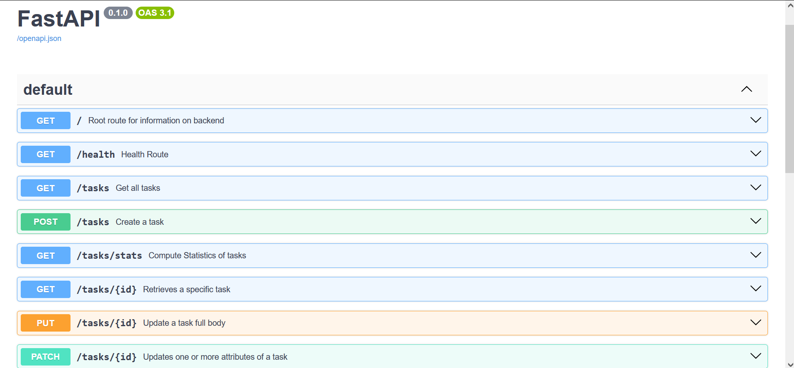
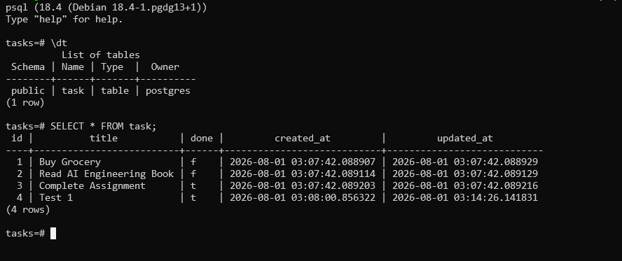
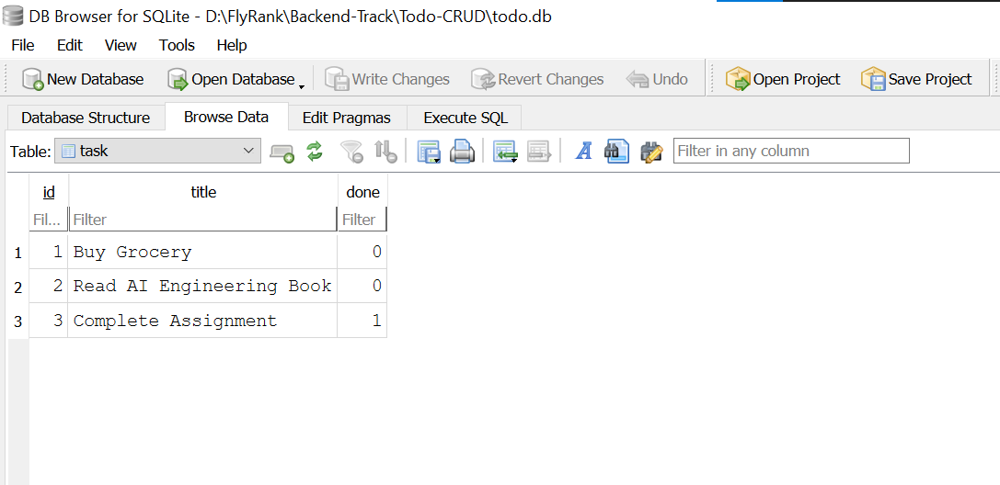

# TODO CRUD
It is a todo CRUD(create, read, update, and delete) backend, which is developed with the help of FastAPI(Backend Framework for python). And for data persistence we used PostgreSQL and SQLModel to store data in postgres.

## Setup:
Since this backend is setup using docker, so we will use docker and eliminate "It works on my pc" error for good.

1. After cloning using `git clone`, open project directory by `cd Todo-CRUD`.
2. Create a .env file by using .env.example and replace the generic secrets to your own choice.
3. After setting up secrets, use `docker compose up` to start your containers.
4. Open browser or curl localhost:8000


## Endpoints: 

| Method | Endpoint | Purpose |
| :--- | :---  | :--- |
| **Get** | "/" | Root endpoint to provide information on versions and available endpoints |
| **GET** | "/health" | Returns the status of server |
| **GET** | "/tasks" | Fetches All tasks with filters. |
| **GET** | "/tasks/{id}" | Fetches a specific tasks with provided ID. |
| **POST** | "/tasks" | Creates a new task. |
| **PUT** | "/tasks/{id}" | Updates the whole body of the provided ID task. |
| **PATCH** | "/tasks/{id}" | Updates either one or all attributes of task body |
| **DELETE** | "/tasks/{id}" | Deltes the task with provided ID. |
| **GET** | "/tasks/stats" | Compute the statistics of tasks in tasks list. |

Checkout Swagger UI on `http://localhost:8000/docs` for more details about endpoints.

---
### Swagger Screenshot:



---
### CURL Command Output:
Here is a create command for curl:
```
curl -X 'POST' \
  'http://localhost:8000/tasks' \
  -H 'accept: application/json' \
  -H 'Content-Type: application/json' \
  -d '{
  "title": "Learn Next JS",
  "done": false
}'
```

and here is its output:
`{"id":6,"title":"Learn Next JS","done":false}`

---
### Database:
For saving the tasks, this CRUD backend uses PostgreSQL inside a container using official PostgreSQL 18+ image which saves its data inside a volume so that data is not lost when we do `docker compose down`.

#### DB Container Screenshot of Data:



---

### Mortality Experiment (When not using volume):
When I removed volume specifications from `compose.yaml`, and did `docker compose up`, then put some data. But after restart my changes were gone because I didnt specify any volume, so postgres image created a temporary one and discarded it when container is destroyed, so we lost all cahnges. That's why we use dedicated volumes for our application.


---
### Mortality Experiment (When Using In-Memory List):
When I created some tasks, updated them and even deleted some. The get api was showing me all changes but as soon as I restart the server, all changes were gone. It happened because my changes were saving in RAM in the form of list in my pyhton program. To store it permanently so that I can access it even after program ends, I have to store it in my disk drive in the form of file. 

---

### AI VS ME (Assignment 01): 

Below is the prompt I provided to Google Antigravity for Assignment 01:

#### Prompt: 
```
Build a todo backend in fastapi python in a single .py file. use REST API conventions and rules while coding. use pydantic validation for each request and response where possible by using pydantic models.
For simplicity use a python list of Task Model. 

Task has these attributes only --> id, title, and done
in task list initialize 3 generic tasks.

And build the following endpoints:
1. root --> root endpoint for fetching name, version, and available endpoints(array) in JSON
2. health --> health endpoint to return the status of backend, like --> status: ok  in JSON
3. get all tasks --> this endpoint should return the whole list of tasks if no query parameters, and there are 2 parameters for this endpoint: 
	i. done(returns the list of same status tasks) ii. search(returns the list of tasks which contains the search string) #both are optional but can be passed simultaneously
4. get task --> this endpoint fetches a specific task from list with the same id
5. create task --> this endpoint creates task but only take title and done in body, also id given to new task is based on a counter which is incremented when each task is created. status code = 201
6. updates task --> this endpoint(PUT) takes an id and a body with title and done both, and updates the whole of task with id provided to the provided body.
7. patch task --> this endpoint(PATCH) takes an id to update and a body with either done or title or both. slightly different from PUT as it is REST convention to use PATCH for single attribute changes.
8. delete task --> this endpoint takes an id and delete that task, and return nothing with 204
9. stats --> this endpoint computes tasks stats and returns a JSON body with total, completed, and pending tasks.
10. reset --> this endpoint serves for testing purpose, and it clears the list and retores 3 generic original tasks in the list.

Use proper HTTP codes like 404, 400, etc where necessary.

Ask me questions if you have any ambiguity regarding this assignment.
```

#### Verdict:
1. AI writes more pythonic code like using enumerates for loop, while I relied on C style for loop.
2. AI summary and description are more professional and cocise than me, AI used docstring for description while I used description attribute in decorator which make AI code more clean.
3. It took me a whole day(including breaks) figuring out and completing this assignment, but for AI it took only **4 seconds**.
4. It did exactly what I asked no more no less. I guess my prompt is good and **GEMINI 3.5** is very powerful model.


---

## Database:

I attached a sqlite database to my backend by replacing in-memory list. So that data can persist even after restart.

Here is one sql command I used in DB Viewer:  
` SELECT * FROM task WHERE done = 1 `  
SQLite uses 0/1 for boolen.   

Which results in returning tasks with done status of 1 (True).

### Why SQLite:
SQLite requires no setup at all as it comes with pyhton itself, Also as I used Fast API Framework for Backend, so I used SQLModel for DB Operations.   

#### Screenshot of the todo.db from DB Viewer:



    

### Added Two Table Columns:
When I added two new columns and started my fastapi server, it started normally but as soon as I hit GET /tasks endpoint it returned 500 Error Code and my terminal was full of errors, but it was one. It was not able to find new attributes of Task. So I researched and found out that either delete db or ALTER the table/migrate with alembic, So I used Alembic and migrate the table and put new columns of created_at and updated_at. 


## AI VS ME (Assignment 02):

This time I gave the model lazy prompt without specifying everything. While the code is working but it is bit over engineered for some part and the main thing is it completely ignored SQLModel because I didnt specify it. But it is fun and new experience to read Raw SQL code.

Prompt:
```
Its time to evolve the fast api backend program from saving tasks in list to a sqlite database inside tasks.db.

Requirements:
The program should seed 3 tasks if the db is empty.
all endpoints will remain same and serve the same purpose. except remove that reset and seed endpoint.
in get endpoint with search and filter also add an option for sort_by(title) in acs or desc order
```
